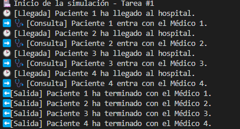

## 🩺 Ejercicio #1 – Tarea 1: Consulta médica

### 🎯 Objetivo

Simular la llegada de 4 pacientes al hospital con un retardo de 2 segundos entre sí, y su atención por 4 médicos distintos (1 por paciente).

- Tiempo de atención por médico: **10 segundos**
- Los médicos se asignan de forma **aleatoria**
- Se imprime en consola cuándo **entra y sale** cada paciente

---

### ❓ Preguntas y respuestas

#### 🔸 ¿Cuántos hilos se están ejecutando en este programa?

**Respuesta:**

Se ejecutan **al menos 5 hilos**:

1. **1 hilo principal** que lanza y controla los pacientes  
2. **4 hilos** (uno por cada paciente) que simulan la atención médica de forma paralela

---

#### 🔸 ¿Cuál de los pacientes entra primero en consulta?

**Respuesta:**

El **Paciente 1**, porque es el primero en llegar y hay médicos disponibles. Cada paciente se lanza cada 2 segundos, y no hay espera inicial.

---

#### 🔸 ¿Cuál de los pacientes sale primero de consulta?

**Respuesta:**

También el **Paciente 1**, porque todos los pacientes tienen el mismo tiempo de consulta (10 segundos), y él fue el primero en entrar.

---

### 📋 Esquema:

---

### 📋 Ejemplo de salida esperada:

--