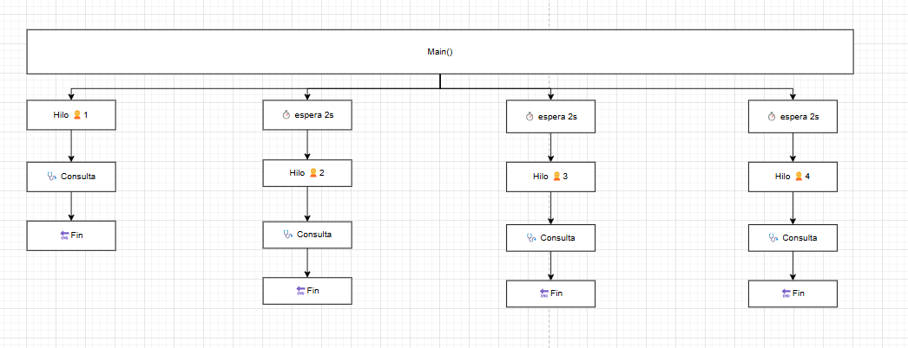
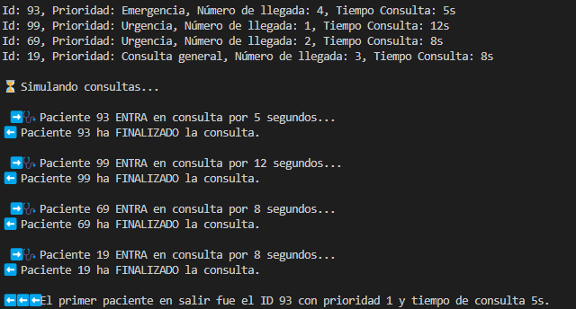

## 🗒️ Ejercicio #1 – Tarea 2: Pacientes con datos

### 🎯 Objetivo

Simular pacientes con comportamientos distintos, asignando los siguientes datos a cada uno:

- Identificador aleatorio entre 1 y 100  
- Tiempo de llegada al hospital (en segundos)  
- Tiempo de consulta aleatorio entre 5 y 15 segundos  
- Estado del paciente:
  - `0`: Espera  
  - `1`: Consulta  
  - `2`: Finalizado  

Se muestra por consola: **Id**, **prioridad**, **número de llegada** y **tiempo de consulta**.

---

### ❓ Pregunta y respuesta

#### 🔸 ¿Cuál de los pacientes sale primero de consulta?

**Respuesta:**

El paciente que tiene el **tiempo de consulta más corto** es el primero en salir, independientemente de su orden de llegada o prioridad.  
Esto se debe a que todos entran en consulta cuando hay médicos disponibles, pero el tiempo que permanecen depende de su valor aleatorio entre 5 y 15 segundos.

---

### 📋 Esquema:

---

### 📋 Ejemplo de salida esperada:

---