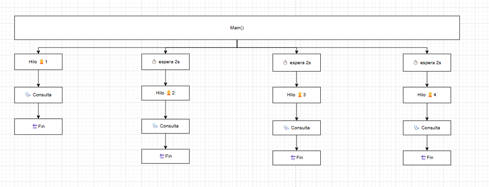
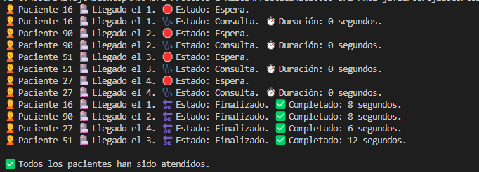

## 📊 Ejercicio #1 – Tarea 3: Visualización del avance

### 🎯 Objetivo

Mostrar por consola el avance del estado de los pacientes: desde su llegada, pasando por la consulta, hasta su finalización. También se muestran los **tiempos entre cambios de estado** y el **orden de llegada**.

---

### ❓ Pregunta

#### 🔸 ¿Has decidido visualizar información adicional a la planteada en el ejercicio? ¿Por qué?

**Respuesta:**

Sí. He mostrado los **tiempos exactos entre estados** utilizando `DateTime` y `TimeSpan`, lo que permite simular de forma más realista el comportamiento del sistema y comprobar que el flujo de atención médica funciona correctamente.

También se ha adaptado el formato de impresión por consola para que coincida exactamente con lo solicitado en el enunciado

#### 🔸 ¿Qué otra información podría ser útil visualizar?

**Respuesta:**

- El médico asignado a cada paciente  
- El uso y disponibilidad de máquinas de diagnóstico  
- El total de tiempo en el hospital por paciente  
- Un resumen final con el orden de atención y duración total

---

### 📋 Esquema:

---

### 📋 Ejemplo de salida esperada:

