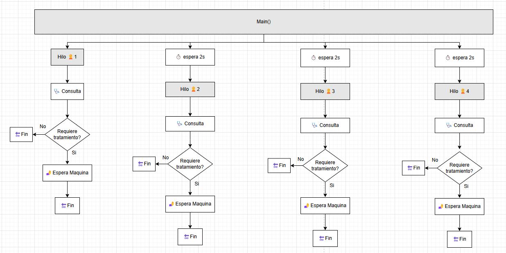
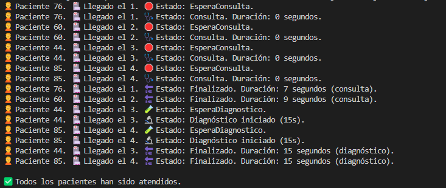

## 🔬 Tarea 1 – Unidades de diagnóstico

En esta tarea se simula el comportamiento de pacientes que, tras pasar por consulta, **requieren diagnóstico adicional** usando máquinas limitadas.

---

## 🎯 Objetivo

- Ampliar la clase `Paciente` con un atributo `requiereDiagnostico` generado aleatoriamente.
- Simular una consulta médica seguida de una posible prueba de diagnóstico.
- Utilizar **2 máquinas de diagnóstico** disponibles de forma concurrente.
- Añadir nuevos estados:
  - `EsperaConsulta`
  - `Consulta`
  - `EsperaDiagnostico`
  - `Finalizado`

---

## ⚙️ Comportamiento del sistema

- Se crean 4 pacientes, cada uno con:
  - Un ID aleatorio
  - Tiempo de llegada
  - Tiempo de consulta aleatorio entre 5 y 15 segundos
  - Requiere o no diagnóstico adicional (booleano aleatorio)
- Los pacientes que necesitan diagnóstico entran en una **cola de espera controlada con un `Semaphore`** que permite el uso de **solo 2 máquinas a la vez**.
- El diagnóstico dura **15 segundos exactos**.

---
### 📋 Esquema:

## 🖥️ Ejemplo de salida esperada

