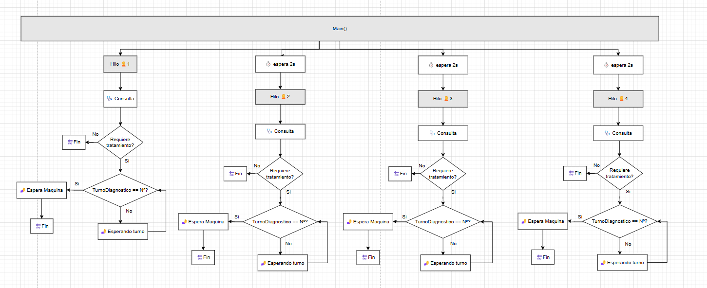
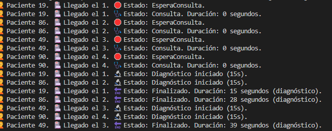

## ✅ Tarea 2 – Sincronización por orden de llegada

Esta tarea amplía la lógica anterior de diagnóstico, obligando a los pacientes que lo necesiten a pasar **en el orden exacto de llegada al hospital**, independientemente del orden en que finalicen su consulta.

---

## 🎯 Objetivo

- Mantener el orden de paso al diagnóstico por llegada (Paciente 1, luego 2, etc.)
- Aunque un paciente finalice la consulta antes, **no puede adelantarse a otro que llegó antes**
- Control de acceso a las 2 máquinas mediante semáforo (`Semaphore`)
- Control de turnos mediante variable sincronizada

---

## 🛠️ Lógica implementada

- Se utiliza un **contador `turnoDiagnostico`** para saber qué paciente debe pasar.
- Cada paciente **espera hasta que su `NumeroLlegada` coincide con el turno actual**.
- Se utiliza un `lock` para asegurar sincronización entre hilos.
- Al finalizar el diagnóstico, el paciente libera la máquina y se incrementa el turno.
- En caso de que el paciente **no requiera diagnóstico**, también se incrementa el turno para evitar bloqueos.

---

## ❓ Preguntas

### 🔸 Explica la solución planteada en tu código y por qué la has escogido.

**Respuesta:**

Se ha utilizado un contador llamado `turnoDiagnostico` junto con un bloqueo (`lock`) para garantizar que los pacientes accedan a las pruebas diagnósticas exactamente en el orden en que llegaron al hospital.  
Cada paciente espera su turno y solo accede a la máquina si coincide con el número asignado. Este enfoque es simple, eficaz y asegura una sincronización justa sin estructuras adicionales.

Para evitar bloqueos, si un paciente no requiere diagnóstico, también incrementa el contador para liberar el turno al siguiente.

---

### 🔸 Plantea otra posibilidad de solución a la que has programado.

**Respuesta:**

Otra opción sería usar una **cola bloqueante personalizada** (por ejemplo, `BlockingCollection`) que mantenga el orden de llegada.  
Un **hilo coordinador** (dispatcher) podría encargarse de liberar a los pacientes en orden, asignándoles las máquinas cuando estén disponibles.  
Este patrón sería más parecido a un sistema real de asignación de turnos, aunque con algo más de complejidad.

---

### 📋 Esquema:

---

## 🖥️ Ejemplo de salida esperada

