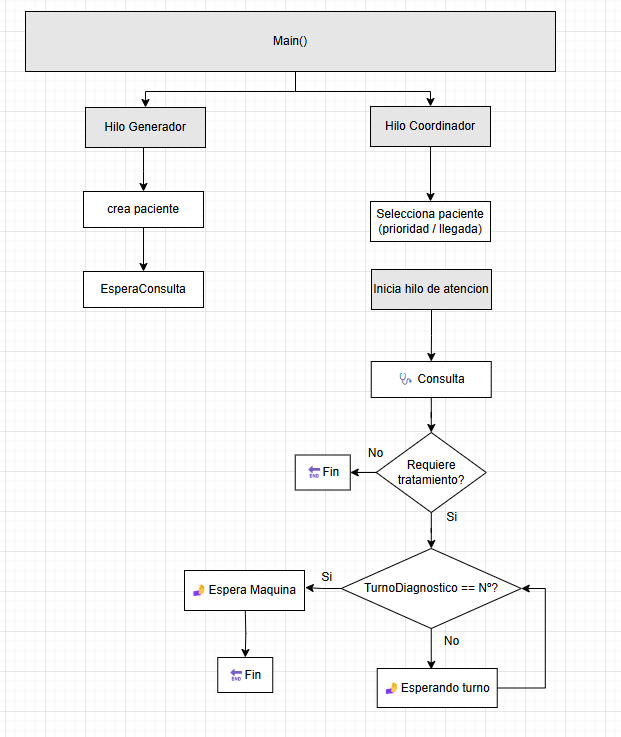
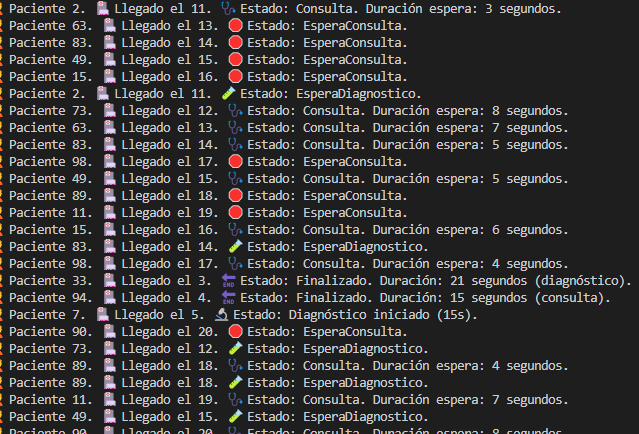

## 👨‍👩‍👧‍👦 Tarea 3 – Más pacientes

En esta tarea se amplía la simulación a **20 pacientes**.  
El sistema mantiene las **4 consultas médicas** con **4 médicos disponibles** y **2 máquinas de diagnóstico**.

---

## 🎯 Objetivo

- Gestionar la llegada de 20 pacientes, uno cada 2 segundos
- Si no hay médico disponible, el paciente debe esperar (estado: `EsperaConsulta`)
- Simular la entrada a consulta solo cuando haya disponibilidad
- Simular diagnóstico (si aplica) usando 2 máquinas
- Mantener el orden de paso a diagnóstico (como en Tarea 2)

---

## ⚙️ Comportamiento del sistema

- Se crean 20 pacientes
- Se usa un `Semaphore` para limitar el acceso a las consultas (4 médicos)
- Otro `Semaphore` controla el acceso a diagnóstico (2 máquinas)
- Cada paciente genera aleatoriamente si requiere diagnóstico
- El orden de acceso a diagnóstico se mantiene gracias a `turnoDiagnostico` (por llegada)

---

## ❓ Preguntas

### 🔸 Explica el planteamiento de tu código y plantea otra posibilidad de solución a la que has programado y por qué has escogido la tuya.

**Respuesta:**

Se ha planteado una solución basada en **semaforización simple y sincronización con turnos**, que permite:

- Limitar la entrada a consulta a un máximo de 4 pacientes simultáneamente.
- Controlar el acceso al diagnóstico manteniendo el **orden de llegada**, independientemente del orden de finalización de la consulta.

Esta solución es **fácil de mantener, eficaz y muy visual** para fines educativos. Se escogió porque simula bien el comportamiento hospitalario sin introducir arquitecturas demasiado complejas.

**Otra solución alternativa:**

Se podría implementar una **cola compartida bloqueante** para los pacientes que esperan consulta y otra para diagnóstico.  
Un **gestor centralizado** (hilo monitor) podría repartir turnos en función del estado de los recursos disponibles.  
Este enfoque se asemeja más a un **sistema real tipo triage hospitalario**, aunque resulta más complejo de codificar y depurar.

---

### 🔸 ¿Los pacientes que deben esperar entran luego a la consulta por orden de llegada? Explica qué tipo de pruebas has realizado para comprobar este comportamiento.

**Respuesta:**

Sí. La entrada a consulta se gestiona con un `Semaphore` de 4 plazas, pero como los pacientes **se lanzan uno cada 2 segundos en hilos independientes**, y **cada uno intenta entrar en orden**, se mantiene automáticamente el orden de llegada a la consulta.

Se ha verificado este comportamiento:

- Asignando un número de llegada a cada paciente (`NumeroLlegada`)
- Imprimiendo por consola su entrada en estado `Consulta`
- Confirmando visualmente que los primeros en llegar son los primeros en entrar (cuando hay médico libre)

En las pruebas, los pacientes que deben esperar, solo entran cuando **alguien libera una consulta**, y se respeta el orden de llegada inicial.

---

### 📋 Esquema:

## 🖥️ Ejemplo de salida esperada

