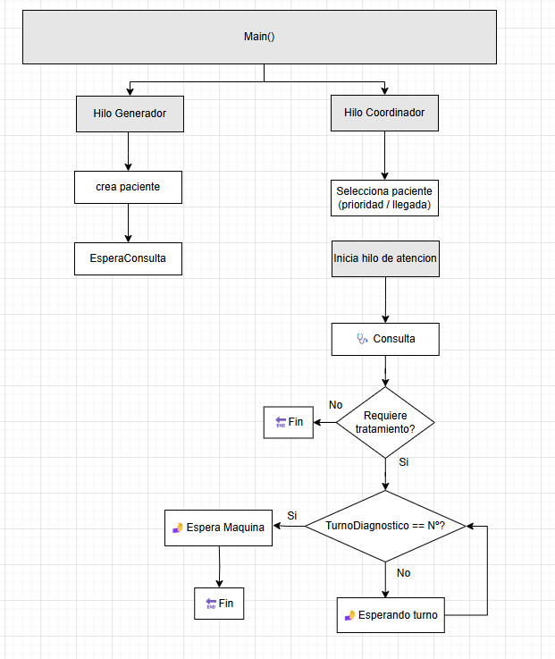
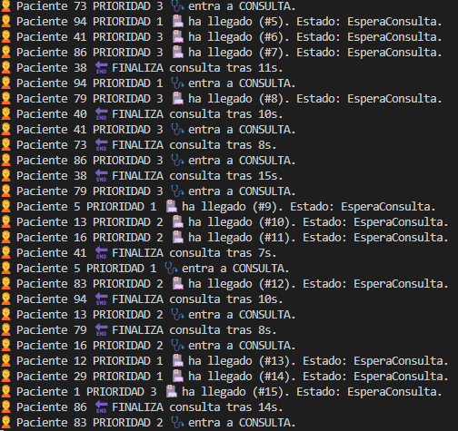

## ✅ Tarea 4 – Prioridades de los pacientes

En esta tarea se introduce el concepto de **prioridad médica** en la atención hospitalaria.  
Cada paciente al llegar recibe una **prioridad aleatoria** entre:

- **1**: Emergencia (más urgente)
- **2**: Urgencia
- **3**: Consulta general (menos urgente)

---

## 🎯 Objetivo

- Ampliar la clase `Paciente` con un nuevo campo `Prioridad` (`int`)
- Gestionar la cola de espera para que los pacientes entren a consulta:
  - Primero por **prioridad** (1 → 2 → 3)
  - En caso de empate, por **orden de llegada**
- Simular el acceso a 4 médicos
- Mostrar los estados por consola y orden correcto

---

## ⚙️ Comportamiento del sistema

- Se generan **20 pacientes**, uno cada 2 segundos
- Cada paciente se añade a una **lista compartida (cola de espera)**
- Un **hilo coordinador** se encarga de:
  - Ordenar la lista por prioridad y llegada
  - Asignar un médico libre al siguiente paciente que le toque
- Se usa `Semaphore` para controlar disponibilidad de los 4 médicos

---

### 📋 Esquema:

## 🖥️ Ejemplo de salida esperada

