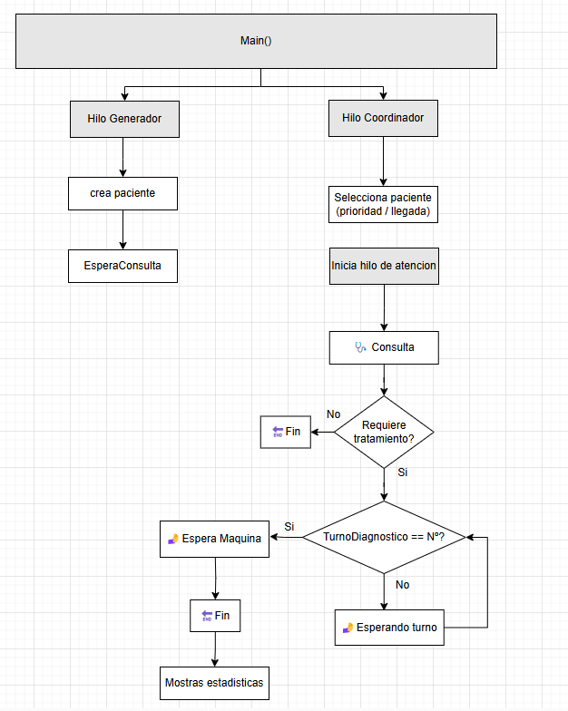
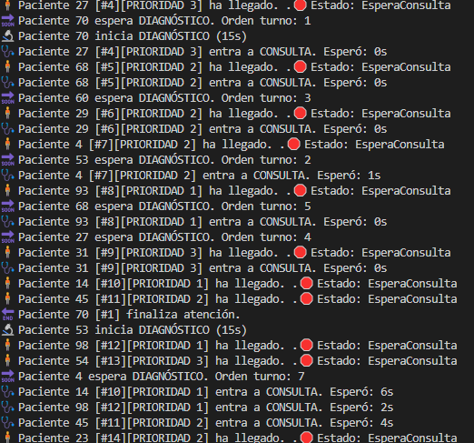

## 📟 Tarea 5 – Estadísticas y logs

En esta tarea se añaden estadísticas al final de la simulación para analizar el funcionamiento del sistema de atención médica durante el día, con una mejora importante en la gestión de turnos de diagnóstico para evitar bloqueos.

---

## 🎯 Objetivo

- Mostrar:
  - Número total de pacientes atendidos por prioridad
  - Tiempo promedio de espera por tipo de paciente
  - Porcentaje de uso promedio de las máquinas de diagnóstico
- Evitar cuelgues asegurando la correcta sincronización del acceso a diagnóstico
- Mejorar la claridad de los mensajes en consola con logs detallados

---

## ⚙️ Comportamiento del sistema

- Se generan 20 pacientes, uno cada 2 segundos
- Cada paciente tiene:
  - Prioridad (1 = Emergencia, 2 = Urgencia, 3 = Consulta general)
  - Tiempo de consulta aleatorio (5–15s)
  - Diagnóstico opcional (aleatorio, 15s si aplica)
- Solo 4 médicos y 2 máquinas de diagnóstico disponibles (limitado por semáforos)
- El sistema guarda:
  - Hora de llegada
  - Inicio y fin de consulta
  - Inicio y fin de diagnóstico (si aplica)
- Al final, se calculan y muestran estadísticas

---

## 🧠 Mejora aplicada: sincronización del turno diagnóstico

Se ha corregido un posible **bloqueo** del sistema cuando un paciente **no necesita diagnóstico** pero **tiene el turno pendiente**.  
Para solucionarlo:

- Se espera activamente a que el turno coincida
- Una vez es su turno, lo libera para el siguiente paciente

Este comportamiento se aplica tanto a pacientes con como sin diagnóstico, garantizando un flujo correcto.

---

### 📋 Esquema:

---

## 🖥️ Ejemplo de salida

