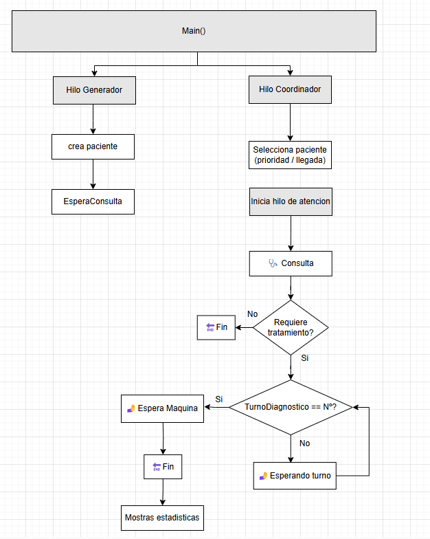
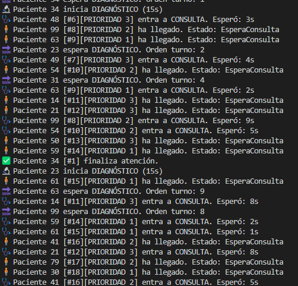

## 🙍♾️ Ejercicio #3 – Tarea 1: Pacientes infinitos

En esta tarea se modifica el comportamiento del sistema para simular un entorno más realista: pacientes que llegan al hospital de forma constante cada 2 segundos, sin un número fijo inicial.

---

## 🎯 Objetivo

- Crear un generador infinito de pacientes que produce uno nuevo cada 2 segundos
- Asignar aleatoriamente a cada paciente:
  - Un tiempo de consulta (5–15s)
  - Una prioridad (1: emergencia, 2: urgencia, 3: consulta general)
  - Si requiere o no diagnóstico
- Mantener la lógica de atención médica, diagnóstico, prioridad y estadísticas
- Evaluar el comportamiento del sistema para distintos volúmenes de pacientes (N = 50, 100, 1000)

---

## ⚙️ Funcionamiento

- El generador de pacientes corre en un hilo aparte
- Cada nuevo paciente se añade a la cola de espera
- El coordinador de atención atiende a los pacientes según prioridad y orden de llegada
- Se controla el acceso a médicos (4) y diagnóstico (2 máquinas)
- Se recogen estadísticas al finalizar (número por prioridad, tiempo promedio de espera, uso de diagnóstico)

---

## ✅ Parte 1: ¿Cumple requisitos?

### [Pruebas]
- Se ejecutó el sistema con límite de 50 pacientes generados
- Todos los pacientes fueron procesados correctamente
- Se respetaron los estados y prioridades
- Se generaron estadísticas correctamente al final

### [Explicación]
Sí, la tarea cumple con los requisitos. El sistema gestiona pacientes nuevos de forma continua cada 2 segundos, sin colapsar.  
Se mantiene la lógica de prioridad y diagnóstico, y los recursos médicos se controlan adecuadamente con semáforos.  
El sistema es escalable mientras el hardware lo permita.

---

## ⚠️ Parte 2: ¿Qué comportamientos no previstos detectas?

### [Pruebas]
- Se aumentó el límite a 100 y 1000 pacientes
- A medida que el número crece:
  - La cola de espera se hace más grande
  - Aumentan los tiempos de espera para diagnóstico
  - Los pacientes se apilan en memoria si el sistema no los puede atender tan rápido

### [Explicación]
- El generador no tiene en cuenta la **capacidad real del hospital**
- No hay una **sala de espera limitada**
- A partir de cierto volumen, el sistema **se congestiona** si no hay límite de entrada

---

## 🧠 Parte 3: ¿Cómo adaptarías tu solución?

### [Explicación]
- Añadir una **sala de espera con capacidad máxima (ej: 20 pacientes)** usando un  `Queue` con límite
- El generador de pacientes debería **detenerse o bloquearse** si la sala está llena
- Se podría implementar una **lógica de descarte o redireccionamiento** si no hay sitio

---

### 📋 Esquema:

## 🖥️ Ejemplo de salida

